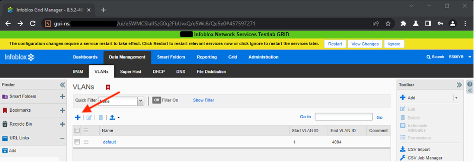
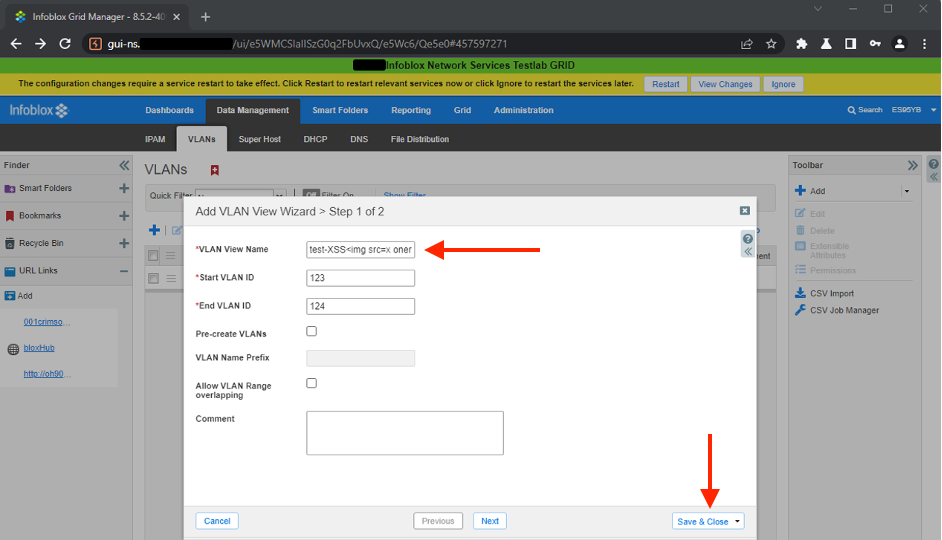
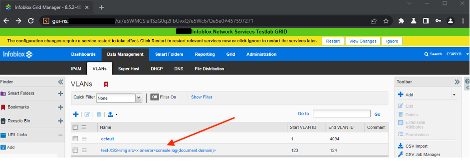
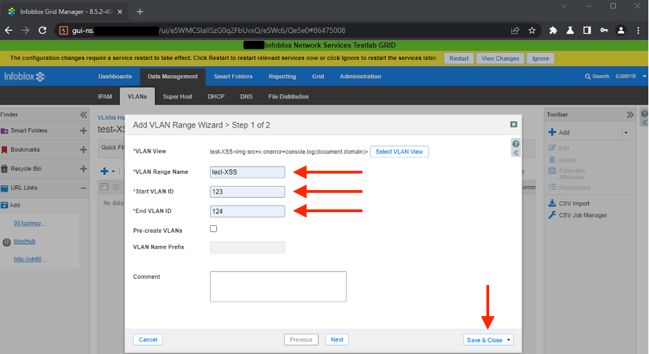
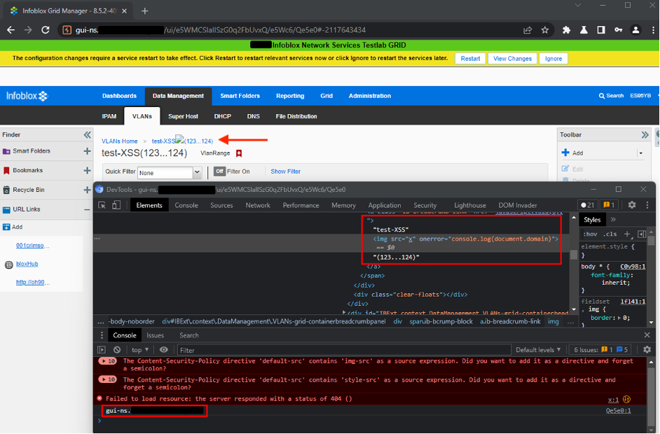

During one of the penetration testing engagements I have identified a second order stored server-side Cross-Site Scripting vulnerability in Infoblox Grid Manager web interface. In this post I will provide a Proof-of-Concept with steps to reproduce this vulnerability.

Grid Manager is a web interface for Infoblox NIOS appliance, which resolves to Network Identity Operating System. The purpose of the NIOS is to provide tools to manage, control and optimize DNS, DHCP, and IP address management (IPAM) in broad enterprise networks.

## CVE-2022-28975

The `Vlan View Name` field is not sanitized on `Vlan Range` page resulting in the possibility of injecting arbitrary JavaScript code. This vulnerability, as almost every other XSS, may be used for unauthorized modification of the content presented in the web application, redirecting user to the third-party services, and then executing a social engineering attack, stealing user's cookies, and taking over their account, or exploitation of the vulnerabilities on the browser level.

Vulnerable version - Infoblox Grid Manager 8.5.2-409296.

**Please note, that I've had access only to the above version of the Infoblox Grid Manager software and it might not be the only vulnerable one. I've tried contacting vendor to get a comprehensive list of all vulnerable versions, but, unfortunately, vendor was not responsive. The only feedback that I received from the vendor was that this vulnerability is known and is being worked on.**

## PoC

1. Add new `VLAN` from `Data Management -> VLANs` page - by clicking plus sign:

2. Inject simple XSS payload, e.g. `` in `VLAN View Name` field and click `Save & Close` button:

3. Click on the name of the added `VLAN`:

4. Click plus sign to add new `VLAN Range`:

5. Input arbitrary values and click `Save & Close` button:

6. Click on the name of the added `VLAN Range`, the payload will be executed by the user’s browser:

## Requirements

The requirement to exploit this vulnerability is being logged in as a user with write permissions for the `VLAN view`. The payload will be executed for every user that visits malicious `VLAN Range` page.
